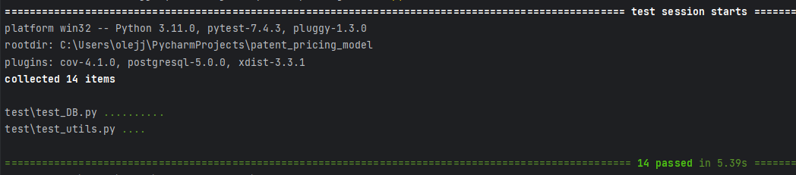
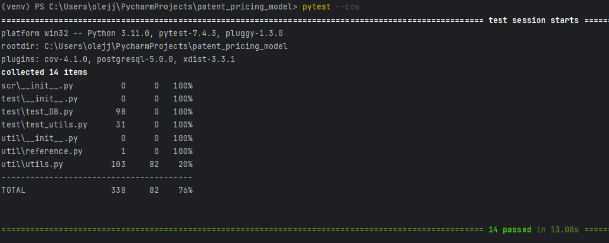
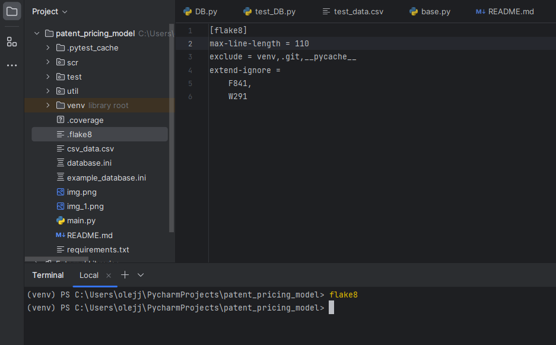

Задача: создать алгоритм, который будет прогнозировать ценообразование на определенном рынке.

Входные данные:

Файл `csv_data.csv`, в котором может быть какое-угодно количество строк. В данном случае 1 000 000 строк. В проекте этот файл заархивирован, поэтому нужно будет разархивировать его в этой же папке.
Стэк используемых технологий:

- python 3.11 - postgresql
Варианты моделей прогнозирования:

- Линейная регрессия(LinearRegression) - Метод случайного леса(RandomForest) - Метод подсчета средней цены
Начало работы:

- Установка виртуального окружения и настройка: ```python -m venv venv``` - Установка зависимостей: ```pip install -r requirements.txt``` - В корне проекта создать файл `database.ini` с параметрами для подключения к БД. Если файла не будет, то программа будет подключаться по дефолту к БД 'postgres'. В корне проекта есть пример файла .ini
Запуск:

- Для начала работы необходимо запустить файл `main.py` - Далее идет работа с пользователем и командами, которые его интересуют.
Тесты:

- Запустить тесты можно с помощью ```pytest```


Coverage:

✅ Код покрыт тестами минимум на 75% - 
Flake8:
✅ Код оформлен согласно pep8 
